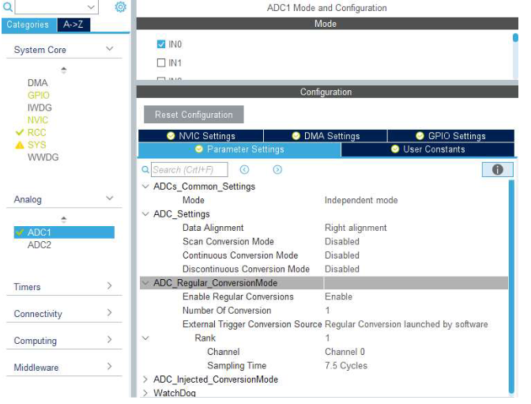
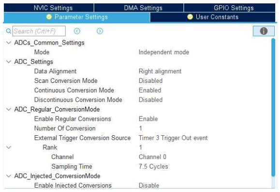
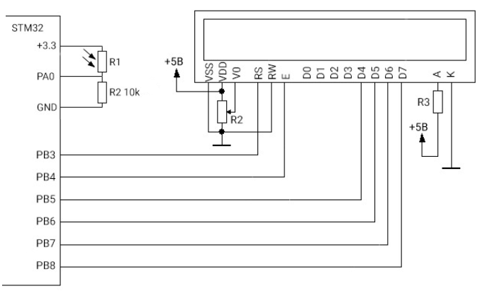

## Протокол лабораторної роботи №1

### Предмет: Мікроконтролери в системах неруйнівного контролю

### Тема: Робота з АЦП мікроконтролерів STM32

### Мета: Ознайомитись з особливостями роботи АЦП мікроконтролерів STM32 та порядком підключення аналогових датчиків. Навчитись створювати програмний код для обробки оцифрованих сигналів.

### Хід роботи

#### CubeMX






#### main.c

Лістинг

```c
/* USER CODE BEGIN Includes */
// !!!
#include "lcd.h"
#include "stdio.h"
/* USER CODE END Includes */

/* USER CODE BEGIN PV */
// !!!
uint16_t i;
char str[50];
char voltage_str[10];
uint16_t adc_val;
uint16_t adc_raw;
/* USER CODE END PV */

/* USER CODE BEGIN 2 */
// !!!
LCD_init();
LCD_String("Voltage: ");
HAL_ADCEx_Calibration_Start(&hadc1); // Калібрування
HAL_ADC_Start_IT(&hadc1);           // Запуск АЦП в режимі переривань
HAL_TIM_Base_Start(&htim3);         // Запуск таймера-тригера
/* USER CODE END 2 */

  /* USER CODE BEGIN WHILE */
  // !!!
  while (1)
  {
    //   adc_raw = HAL_ADC_GetValue(&hadc1);
      // Розрахунок напруги: (ADC_val * Vref) / Max_Code
      adc_val = ((float)adc_raw * 3.3 / 4096); 
      
      sprintf(str, "%.2fv", u);
      LCD_SetPos(9, 0);
      LCD_String(str);
      
      HAL_Delay(100);
      HAL_GPIO_WritePin(LED_GPIO_Port, LED_Pin, GPIO_PIN_SET);
    /* USER CODE END WHILE */

/* USER CODE BEGIN 4 */
// !!!
// Викликається автоматично після завершення перетворення
void HAL_ADC_ConvCpltCallback(ADC_HandleTypeDef* hadc)
{
    if(hadc->Instance == ADC1)
    {
        adc_raw = HAL_ADC_GetValue(hadc);
    }
}
/* USER CODE END 4 */

```

#### Схема підключення



### Висновок

Під час лабораторної роботи було вивчено принцип роботи АЦП послідовного наближення в STM32. Ми навчилися налаштовувати регулярні канали, використовувати програмний запуск та запуск за апаратним тригером (таймером). Використання переривань (IT) дозволяє звільнити ресурси процесора для інших завдань, а попереднє калібрування підвищує точність вимірювань. Робота з фоторезистором продемонструвала практичне застосування АЦП для зчитування даних з аналогових сенсорів.

---

### Контрольні запитання

1. Поясніть принцип роботи АЦП послідовного наближення.

Працює за принципом «зважування». Вхідна напруга порівнюється з напругою від внутрішнього ЦАП. Спочатку встановлюється значення 1/2 від опорної напруги. Якщо вхідний сигнал більший, біт залишається «1», якщо менший — «0». Процес повторюється для кожного наступного розряду (1/4, 1/8 і т.д.).

2. Назвіть типи каналів АЦП STM32 та різницю між ними.

* Регулярні канали: обробляються по черзі в загальній черзі, мають один спільний регістр результату (дані затираються новими).
* Інжектовані канали: мають пріоритет (можуть переривати регулярні) та власні регістри для кожного з 4-х каналів.

3. Опишіть режими роботи АЦП STM32.

* Один канал/одноразово: один замір і зупинка.
* Один канал/безперервно: АЦП сам перезапускається після кожного вимірювання.
* Сканування (декілька каналів): послідовне опитування групи каналів.
* Переривчастий режим: розбиття послідовності на короткі підгрупи.

4. Способи зчитати результат перетворення АЦП.

* Опитування прапорця (Polling): чекаємо завершення у циклі.
* Переривання (Interrupt): МК викликає функцію-обробник після готовності даних.
* Прямий доступ до пам’яті (DMA): дані автоматично переносяться в ОЗП без участі процесора.

5. Що таке «час перетворення» та на що він впливає?

Це сума часу вибірки (заряд конденсатора) та часу самого перетворення (12.5 циклів для 12 біт). Він визначає максимальну швидкість оновлення даних та залежить від опору джерела сигналу.

6. Як налаштувати частоту дискретизації 1 кГц?

Необхідно використати таймер як джерело тригера. Налаштувати таймер так, щоб подія `Update` відбувалася 1000 разів на секунду, і в налаштуваннях АЦП обрати цей таймер у `External Trigger Conversion Source`.

7. Різниця між частотою дискретизації та тактування.

* Частота тактування: швидкість роботи внутрішньої логіки АЦП (макс. 14 МГц для STM32F103).
* Частота дискретизації: як часто ми робимо повний замір (наприклад, 1000 разів на секунду).

8. Як налаштувати безперервний режим з перериваннями (функціонування модуля, при якому аналого-цифрове перетворення перезапускається автоматично одразу після завершення попереднього циклу, а процесор отримує сигнал про готовність даних через спеціальний механізм переривань.)?

В CubeMX встановити `Continuous Conversion Mode: Enabled`, у вкладці `NVIC` дозволити переривання від АЦП. У коді використати `HAL_ADC_Start_IT()` та реалізувати `HAL_ADC_ConvCpltCallback()`.