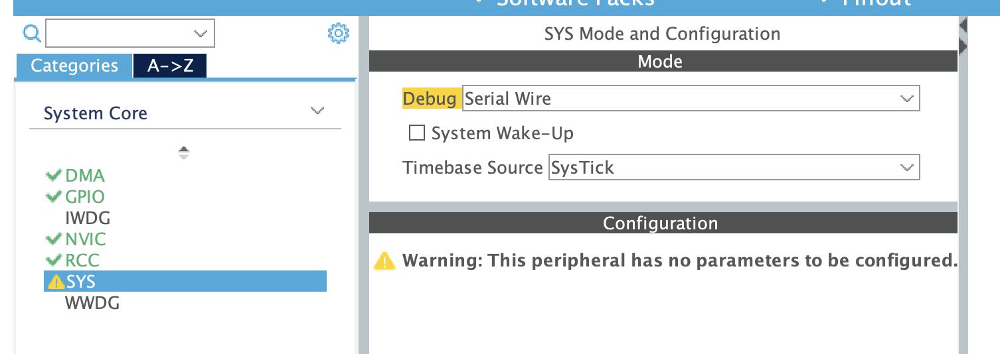
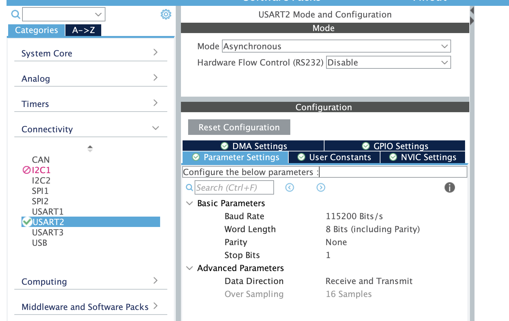
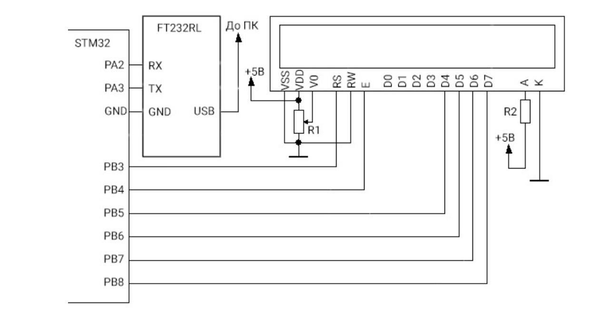
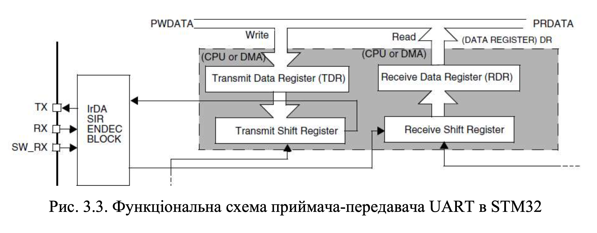

## Протокол лабораторної роботи №3

### Предмет: Мікроконтролери в системах неруйнівного контролю
### Тема: Робота з інтерфейсом передачі даних UART
### Мета: Ознайомитись з принципами роботи UART, навчитись програмувати передачу та прийом даних у різних режимах (Ordinary, Interrupt, DMA) за допомогою бібліотеки HAL.

### Хід роботи

#### CubeMX







#### [main.c](img/Core/Src/main.c)

0. USER CODE BEGIN Includes:
    * 'lcd.h' для зручної роботи з дисплеєм

1.  Оголошення буферів (`PV`):
    * `trans[]`: масив, що містить текстовий рядок для відправки на комп'ютер.
    * `received[8]`: масив для зберігання прийнятих даних. 

2.  Ініціалізація периферії (`User Code 2`):
    * Додано виклик `LCD_init()` для підготовки дисплея до роботи.
    * Запущено функцію `HAL_UART_Receive_DMA()`, яка переводить UART у режим очікування даних у фоновому режимі (без участі процесора).
    * `HAL_UART_Transmit_DMA()`: кожні 500 мс відправляє дані на ПК. Використання DMA дозволяє мікроконтролеру не чекати завершення передачі кожного біта, а продовжувати виконання інших завдань. 
    * Перевірка прапорця стану DMA: ми відстежуємо, коли канал DMA закінчив прийом 8 байт (`HAL_DMA_STATE_READY`). Як тільки пакет отримано, він виводиться на LCD через `LCD_String()`. 


Лістинг
```c
/* USER CODE BEGIN Includes */
// !!!
#include "lcd.h"
/* USER CODE END Includes */

/* USER CODE BEGIN PV */
// !!!
uint8_t trans[] = "UART Transmit from STM32\n";
char received[9] = {0};
const int received_size = sizeof(received)/sizeof(char)-1;         
/* USER CODE END PV */

  /* USER CODE BEGIN WHILE */
  // !!!
  LCD_Init();
  LCD_Clear();
  LCD_SetPos(0, 0);
  LCD_String("Received: len=");
  LCD_Char(received_size + '0');
  HAL_UART_Receive_DMA(&huart2, (uint8_t*)received, received_size);
  while (1)
  {
    HAL_GPIO_TogglePin(LED_GPIO_Port, LED_Pin);
    HAL_UART_Transmit_DMA(&huart2, trans, sizeof(trans)-1); 
    HAL_Delay(500);
    if(hdma_usart2_rx.State == HAL_DMA_STATE_READY) //if(huart2.RxXferCount == 0) 
    {
      LCD_SetPos(0, 1);
      LCD_String(received);
      HAL_UART_Receive_DMA(&huart2, (uint8_t*)received, received_size); // Перезапуск прийом
      //hdma_usart2_rx.State = HAL_DMA_STATE_BUSY;// Скидання стану DMA для прийому, не обов'язково
    }
  }
  /* USER CODE END 3 */
```

#### Схема




Відправка з монітору порту `hi from laptop`

> оскільки буфер символів довжиною 8 останнє слово не видно :(


### Висновок
Під час виконання роботи було засвоєно практичні навички налаштування модуля UART у мікроконтролері STM32. Використання режиму DMA дозволило організувати ефективний обмін даними з мінімальним навантаженням на центральний процесор. Встановлено, що для коректного відображення символів на LCD важливо враховувати розмір буфера та наявність символу кінця рядка. Робота підтвердила переваги асинхронної передачі даних у системах керування.


---

1. Опишіть принцип роботи та області застосування інтерфейсу передачі даних UART.

UART забезпечує асинхронну послідовну передачу даних побітно без використання спільного тактового сигналу. Застосовується для зв'язку між мікроконтролерами, підключення периферійних модулів та обміну даними з комп'ютером.

2. Проаналізуйте відмінності між інтерфейсами UART та USART.

UART працює виключно в асинхронному режимі. USART є універсальним і підтримує як асинхронну, так і синхронну передачу даних завдяки наявності додаткової лінії тактового сигналу.

3. Поясніть процедуру передачі даних за протоколом UART.

Передача починається зі стартового біта низького рівня, за яким слідують від 5 до 9 бітів корисних даних. Після цього може йти біт парності, а завершується посилка одним або двома стоповими бітами високого рівня.

4. Поясніть призначення виводів CTS та RTS, обґрунтуйте необхідність їх використання.

CTS та RTS використовуються для апаратного керування потоком даних. Вони дозволяють пристроям повідомляти про готовність приймати дані, що запобігає переповненню буферів та втраті інформації.

5. Розкрийте призначення та необхідність використання біту парності.

Біт парності слугує для базового апаратного контролю цілісності даних. Він дозволяє виявити прості помилки, що могли виникнути через перешкоди на лінії під час передачі байта.

6. Наведіть та поясніть схему підключення пристроїв за інтерфейсом UART.

Пристрої підключаються перехресно: лінія передавача TX першого пристрою з'єднується з лінією приймача RX другого, і навпаки. Обов'язковою умовою є з'єднання їх спільних ліній землі GND.

7. Поясніть, що таке «Baud rate» та з яких міркувань обирається швидкість передачі даних за інтерфейсом UART.

Baud rate позначає кількість переданих бітів за секунду. Швидкість обирається однаковою для обох пристроїв з урахуванням довжини ліній зв'язку, рівня електромагнітних завад та тактової частоти мікроконтролерів.

8. Обґрунтуйте необхідність використання технології DMA під час передачі даних. Наведіть приклади, коли використання DMA може бути недоцільним.

DMA дозволяє передавати масиви даних між периферією та пам'яттю без участі процесора, що суттєво економить його обчислювальні ресурси. Використання DMA недоцільне при передачі поодиноких байтів або дуже рідкісних повідомлень, оскільки час на налаштування каналу DMA перевищить час самої передачі.

9. Поясніть, як і для чого виконується перевірка заповненості буфера прийнятих даних під час прийому інформації за протоколом UART із використанням бібліотеки HAL.

Перевірка виконується через контроль внутрішніх лічильників, таких як RxXferCount, або перевірку загального стану інтерфейсу RxState. Це необхідно для підтвердження того, що очікувана кількість байтів повністю надійшла до буфера і дані готові до обробки програмою.

10. Наведіть блок-схему структури апаратної частини інтерфейсу UART в мікроконтролерах STM32 та розкрийте принципи її роботи.

Апаратна частина складається з генератора швидкості (Baud Rate Generator), регістрів даних та зсувних регістрів приймача і передавача, а також блоку керування. Процесор або DMA записує байт у регістр передавача, звідки він переноситься у зсувний регістр і побітно видається на лінію TX; приймач працює у зворотному порядку, збираючи біти з лінії RX у зсувний регістр.

