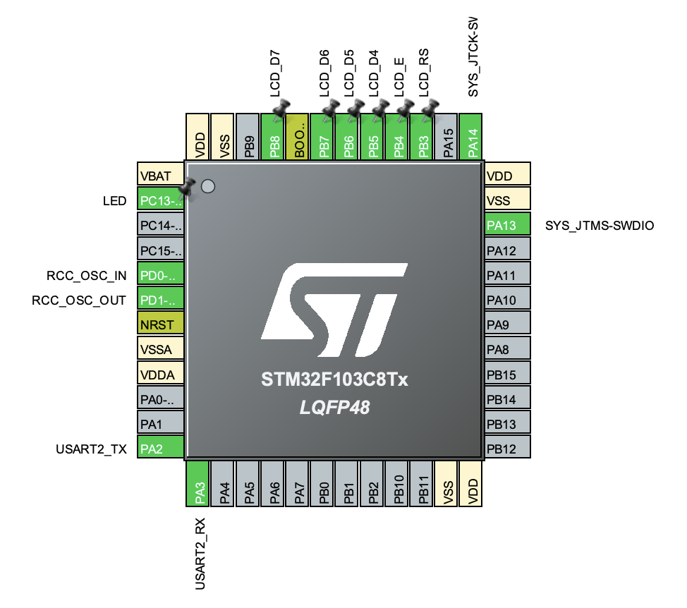
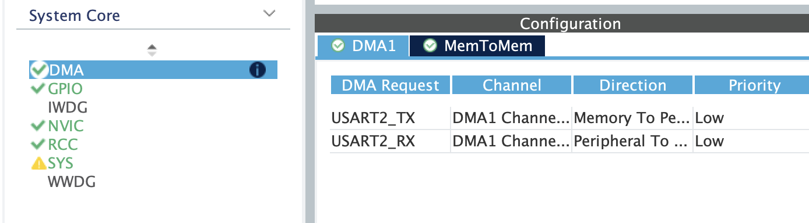
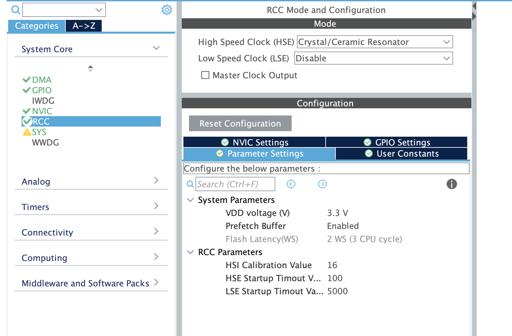
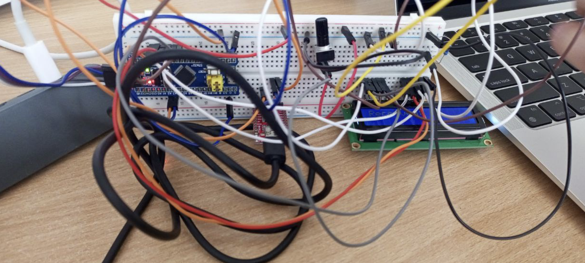
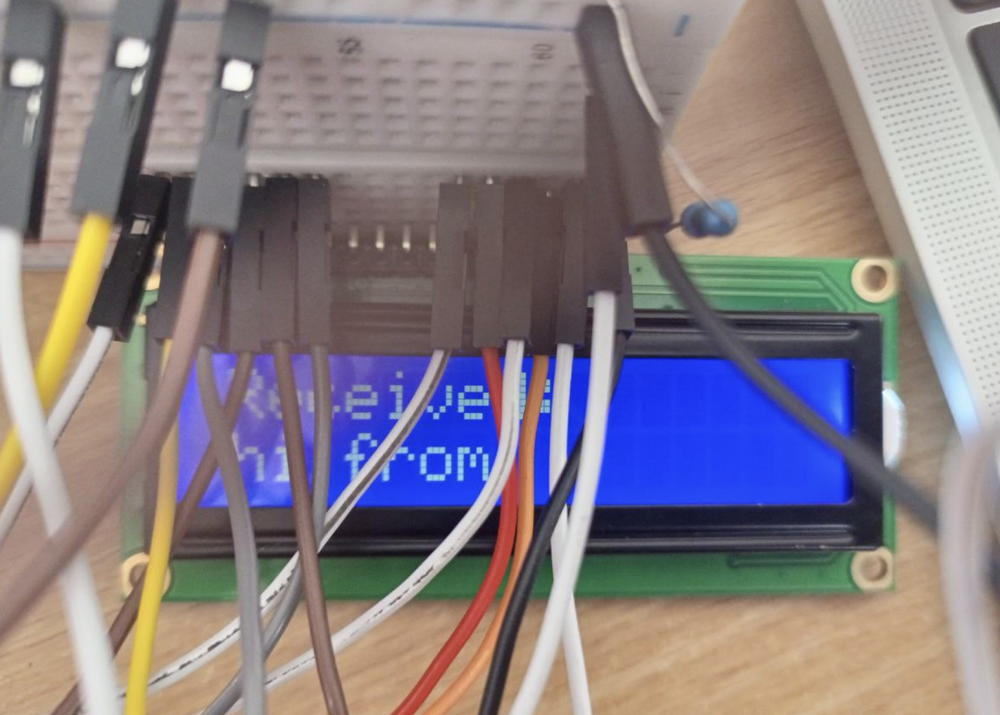

## Протокол лабораторної роботи №3

### Предмет: Мікроконтролери в системах неруйнівного контролю
### Тема: Робота з інтерфейсом передачі даних UART
### Мета: Ознайомитись з принципами роботи UART, навчитись програмувати передачу та прийом даних у різних режимах (Ordinary, Interrupt, DMA) за допомогою бібліотеки HAL.

### Хід роботи

#### CubeMX








#### [main.c](Core/Src/main.c)

0. USER CODE BEGIN Includes:
    * 'lcd.h' для зручної роботи з дисплеєм

1.  Оголошення буферів (`PV`):
    * `trans[]`: масив, що містить текстовий рядок для відправки на комп'ютер.
    * `received[8]`: масив для зберігання прийнятих даних. 

2.  Ініціалізація периферії (`User Code 2`):
    * Додано виклик `LCD_init()` для підготовки дисплея до роботи.
    * Запущено функцію `HAL_UART_Receive_DMA()`, яка переводить UART у режим очікування даних у фоновому режимі (без участі процесора).

3.  Логіка у головному циклі (`While`):
    * `HAL_UART_Transmit_DMA()`: кожні 500 мс відправляє дані на ПК. Використання DMA дозволяє мікроконтролеру не чекати завершення передачі кожного біта, а продовжувати виконання інших завдань. 
    * Перевірка прапорця стану DMA: ми відстежуємо, коли канал DMA закінчив прийом 8 байт (`HAL_DMA_STATE_READY`). Як тільки пакет отримано, він виводиться на LCD через `LCD_String()`. 


Лістинг
```c
/* USER CODE BEGIN Includes */
// !!!
#include "lcd.h"
/* USER CODE END Includes */

/* USER CODE BEGIN PV */
// !!!
uint8_t trans[] = "UART Transmit from STM32\n";
char received[8] = {0};            
/* USER CODE END PV */

  /* USER CODE BEGIN 2 */
  // !!!
  LCD_Init();                          // Ініціалізація дисплея 
  LCD_Clear();
  LCD_String("Received:");             // Заголовок у першому рядку
  // Запускаємо циклічний прийом 8 байт через DMA
  HAL_UART_Receive_DMA(&huart2, (uint8_t*)received, 8);
  /* USER CODE END 2 */

    /* USER CODE BEGIN 3 */
    // !!!
    HAL_UART_Transmit_DMA(&huart2, trans, sizeof(trans)-1); 
    HAL_Delay(500);
    if(hdma_usart2_rx.State == HAL_DMA_STATE_READY) 
    {
      LCD_SetPos(0, 1);                // Перехід на другий рядок
      LCD_String(received);            // Вивід прийнятих символів
      // Перезапуск прийому для наступної порції даних
      HAL_UART_Receive_DMA(&huart2, (uint8_t*)received, 8); 
    }
  }
  /* USER CODE END 3 */
```

#### Схема




Відправка з монітору порту `hi from laptop`

> оскільки буфер символів довжиною 8 останнє слово не видно :(



### Висновок
Під час виконання роботи було засвоєно практичні навички налаштування модуля UART у мікроконтролері STM32. Використання режиму DMA дозволило організувати ефективний обмін даними з мінімальним навантаженням на центральний процесор. Встановлено, що для коректного відображення символів на LCD важливо враховувати розмір буфера та наявність символу кінця рядка. Робота підтвердила переваги асинхронної передачі даних у системах керування.


Чи потрібно додати схему підключення компонентів до цього протоколу?