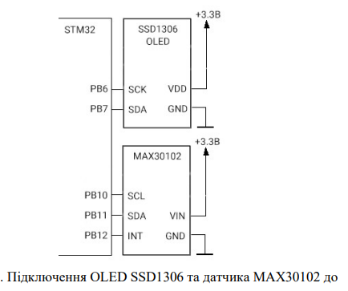
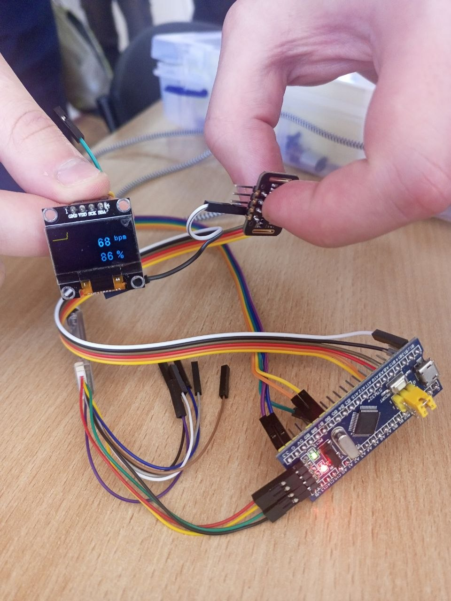

# Звіт з лабораторної роботи №5

Тема: РОБОТА З ІНТЕРФЕЙСОМ ПЕРЕДАЧІ ДАНИХ I2C, OLED ДИСПЛЕЄМ ТА МОДУЛЕМ ПУЛЬСОКСИМЕТРУ

Мета: Ознайомитись з особливостями роботи інтерфейсу передачі даних I2C. Навчитись створювати програмний код для зчитування даних з датчиків за допомогою інтерфейсу I2C.

---

## Підключення





---
## 1. Програмний код керування (main.c)

Нижче наведено розроблений програмний код, який реалізує отримання даних з датчика MAX30102 по I2C, їх програмну фільтрацію (гістерезис) та виведення стабільних значень пульсу, сатурації і графіка фотоплетизмограми на OLED-дисплей SSD1306.

```c

/* USER CODE BEGIN Includes */
// !!!
#include "fonts.h"
#include "ssd1306.h"
#include "stdio.h"
#include "max30102.h"
/* USER CODE END Includes */

/* USER CODE BEGIN PV */
// !!!
extern uint8_t spo2;
extern uint8_t heartRate;
int16_t diff =0;
char SPO2[8] =  {0};
char HR[8] = {0};
int16_t diff_past = 0;
uint8_t i = 0;
/* USER CODE END PV */

/* USER CODE BEGIN WHILE */
  // !!!
  SSD1306_Init();
  SSD1306_GotoXY (0,0);
  SSD1306_Puts ("max30102", &Font_11x18, 1);
  SSD1306_GotoXY (99,20);
  SSD1306_Puts ("bpm", &Font_7x10, 1);
  SSD1306_GotoXY (99,45);
  SSD1306_Puts ("%", &Font_11x18, 1);
  SSD1306_UpdateScreen();

  HAL_TIM_Base_Start_IT(&htim2);

  max30102_init();
  uint8_t consecutive_valid = 0;
  uint8_t is_showing_pulse = 255; 
  uint8_t past_heartRate = 0;
  int16_t diff_past = 0;

  while (1)
  {
    if (HAL_GPIO_ReadPin(GPIOB, GPIO_PIN_12) == GPIO_PIN_RESET) 
    {
      HAL_GPIO_TogglePin(GPIOC, GPIO_PIN_13);
      
      max30102_cal();
      spo2 = max30102_getSpO2();
      heartRate = max30102_getHeartRate();
      int16_t current_diff = max30102_getDiff();

      int16_t graph_val = current_diff;
      if (graph_val > 15) graph_val = 15;
      if (graph_val < 0) graph_val = 0;

      if (i == 0) diff_past = graph_val;
      
      SSD1306_DrawLine(i, 15 - diff_past, i + 1, 15 - graph_val, 1);
      diff_past = graph_val;

      if (i > 124) {
        SSD1306_DrawFilledRectangle(0, 0, 127, 16, 0);
        i = 0;
      } else {
        i++;
      }

      uint8_t is_valid_range = (heartRate >= 30 && heartRate <= 220 && spo2 > 0);
      uint8_t is_stable = 0;

      if (is_valid_range) {
        if (past_heartRate == 0) {
          is_stable = 1; 
        } else {
          int16_t hr_delta = abs((int16_t)heartRate - (int16_t)past_heartRate);
          int16_t threshold = (past_heartRate * 20) / 100;
          
          if (hr_delta <= threshold) {
            is_stable = 1;
          }
        }
      }


      if (is_stable) {
        past_heartRate = heartRate; 
        if (consecutive_valid < 10) consecutive_valid++;
      } else {
        if (consecutive_valid > 0) consecutive_valid--;
        if (consecutive_valid == 0) past_heartRate = 0; 
      }

      uint8_t should_show_pulse = (consecutive_valid >= 3); 

      if (should_show_pulse != is_showing_pulse) 
      {
        is_showing_pulse = should_show_pulse;
        
        
        SSD1306_DrawFilledRectangle(0, 17, 128, 47, 0); 
        
        if (is_showing_pulse) 
        {

          SSD1306_GotoXY(99, 20);
          SSD1306_Puts("bpm", &Font_7x10, 1);
          SSD1306_GotoXY(99, 45);
          SSD1306_Puts("%", &Font_11x18, 1);
        }
        else 
        {
          SSD1306_GotoXY(0, 25);
          SSD1306_Puts("Scanning", &Font_7x10, 1);
          SSD1306_GotoXY(0, 45);
          SSD1306_Puts("pulse...", &Font_7x10, 1);
        }
      }

      if (is_showing_pulse) 
      {
        sprintf(HR, "%3d", heartRate > 999 ? 999 : heartRate);
        sprintf(SPO2, "%3d", spo2);
        
        SSD1306_GotoXY(60, 20);
        SSD1306_Puts(HR, &Font_11x18, 1);
        SSD1306_GotoXY(60, 45);
        SSD1306_Puts(SPO2, &Font_11x18, 1);
      }

      SSD1306_UpdateScreen();
    }
    /* USER CODE END WHILE */


```

---

## 2. Контрольні запитання

1. Опишіть принцип роботи та області застосування інтерфейсу передачі даних I2C.
I2C (Inter-Integrated Circuit) — це послідовна напівдуплексна двопровідна шина. Передача даних здійснюється по двох лініях: SDA (лінія даних) і SCL (лінія тактування). Працює за принципом «Ведучий-Підлеглий» (Master-Slave). Ведучий генерує тактові імпульси та ініціює обмін, звертаючись до підлеглих за їхніми унікальними 7- чи 10-бітними адресами. Застосовується для зв'язку мікроконтролера з периферією на коротких відстанях (на одній платі): датчиками, EEPROM-пам'яттю, RTC, дисплеями (OLED/LCD).

2. Наведіть приклад монтажної схеми для підключення пристроїв за інтерфейсом I2C, поясніть переваги та недоліки такої схеми.
Схема: До виводів SDA і SCL мікроконтролера паралельно підключаються відповідні виводи всіх периферійних пристроїв. Обидві лінії обов'язково підтягуються до напруги живлення (VDD) через резистори (зазвичай від 2.2 кОм до 10 кОм), оскільки виводи працюють у режимі "відкритий колектор" (Open-Drain).

* Переваги: Використовує лише 2 контакти мікроконтролера незалежно від кількості пристроїв; вбудована апаратна система адресації; наявність підтвердження отримання даних (ACK/NACK).
* Недоліки: Обмежена швидкість передачі (найчастіше 100 або 400 кбіт/с); напівдуплексний режим (не можна одночасно передавати і приймати); чутливість до ємності шини, що обмежує довжину проводів до кількох десятків сантиметрів.

3. Розкрийте процес передачі адреси та даних від ведучого до підлеглого пристрою I2C.
Ведучий ініціює передачу генерацією умови START (SDA переходить в 0 при високому SCL). Далі він відправляє 7 біт адреси підлеглого та 1 біт напрямку (0 — запис, Write). Якщо підлеглий з такою адресою існує, він притягує лінію SDA до нуля (сигнал ACK) на 9-му такті. Після цього ведучий відправляє по 8 біт (1 байт) даних. Після кожного байта підлеглий надсилає підтвердження (ACK). Завершується передача умовою STOP (SDA переходить в 1 при високому SCL).

4. Опишіть порядок зчитування даних ведучим від підлеглого пристрою за інтерфейсом I2C.
Ведучий формує умову START, відправляє 7-бітну адресу пристрою + біт напрямку (1 — читання, Read). Підлеглий відповідає ACK. Далі підлеглий починає видавати байти даних на шину. Після кожного прийнятого байта ведучий формує сигнал підтвердження ACK, щоб сказати "я готовий прийняти ще". Коли ведучий хоче припинити читання, після останнього прийнятого байта він не генерує підтвердження (видає NACK) і формує умову STOP.

5. Поясніть процес обміну даних за I2C між ведучим і підлеглим пристроями у випадку складної (вкладеної) організації пам’яті підлеглого.
Якщо датчик має внутрішні регістри (як MAX30102), процес складається з двох етапів (комбінований формат). Спочатку ведучий відправляє адресу пристрою з бітом запису (W) і передає 1 байт — номер (адресу) внутрішнього регістра. Потім, не генеруючи STOP, ведучий формує умову REPEATED START (Повторний старт), знову надсилає адресу пристрою, але вже з бітом читання (R). Після цього підлеглий починає передавати дані, починаючи з вказаного регістра.

6. Опишіть будову та особливості OLED дисплею SSD1306.
SSD1306 — це контролер монохромних OLED-матриць, який має вбудовану пам'ять GDDRAM, генератор напруги живлення матриці та інтерфейси зв'язку (I2C або SPI). Особливість OLED полягає в тому, що кожен піксель є окремим світлодіодом (не потребує підсвітки). Контролер підтримує апаратний скролінг, регулювання контрастності та інверсію кольорів.

7. Поясніть структуру організації пам’яті дисплеїв на контролері SSD1306.
Вбудована пам'ять GDDRAM має розмір 128 х 64 біт. Вона розділена на 8 сторінок (Pages) — від Page 0 до Page 7. Кожна сторінка містить 128 колонок (стовпців). Один байт даних, записаний у стовпець, відповідає 8 пікселям по вертикалі. Кожен біт байта відповідає одному пікселю (1 - світиться, 0 - не світиться).

8. Опишіть методику неінвазійного вимірювання пульсу та сатурації.
Використовується метод фотоплетизмографії. Тканина (палець) просвічується світлодіодами двох довжин хвиль: червоним (Red, бл. 660 нм) та інфрачервоним (IR, бл. 880 нм). Фотодетектор вимірює відбите або пропущене світло.

* Пульс визначається шляхом аналізу пульсацій (зміни об'єму крові в судинах) — так званої змінної (AC) складової сигналу.
* Сатурація (SpO2) розраховується на основі різниці поглинання. Гемоглобін, насичений киснем (оксигемоглобін), краще поглинає IR і пропускає червоний, а ненасичений — навпаки. Відношення амплітуд пульсацій для обох хвиль дозволяє обчислити % кисню.

9. Опишіть принцип роботи та внутрішню будову датчика MAX30102.
MAX30102 — це інтегрований модуль пульсоксиметрії. У ньому розміщені: внутрішній червоний та IR світлодіоди, фотодіод із високою чутливістю, малошумний аналоговий тракт (підсилювач), 18-бітний АЦП та цифровий фільтр з придушенням перешкод від зовнішнього світла (50/60 Гц). Дані накопичуються у внутрішньому FIFO-буфері, звідки мікроконтролер може зчитувати їх через I2C інтерфейс.

10. Поясніть алгоритм виведення на дисплей виміряних значень сатурації та пульсу, а також принцип побудови графіку серцевого ритму.
Алгоритм отримує дані HR та SpO2 з датчика. Для уникнення "мерехтіння" від випадкових шумів застосовується програмний фільтр: результати виводяться лише якщо підряд зафіксовано кілька стабільних значень пульсу (відхилення між якими < 20%). Для цього на екран виводиться форматований текст (`sprintf`) функціями бібліотеки SSD1306.
Графік будується шляхом отримання миттєвого значення амплітуди пульсової хвилі. Екран умовно ділиться на зони. Для графіка виділяється смуга висотою 16 пікселів. Поточне значення приводиться до діапазону 0..15. Від попередньої координати по осі X до поточної малюється лінія (`SSD1306_DrawLine`). Коли координата X досягає правого краю (X=127), лічильник скидається на 0, а зона графіка зафарбовується чорним прямокутником для нового циклу відмальовування.